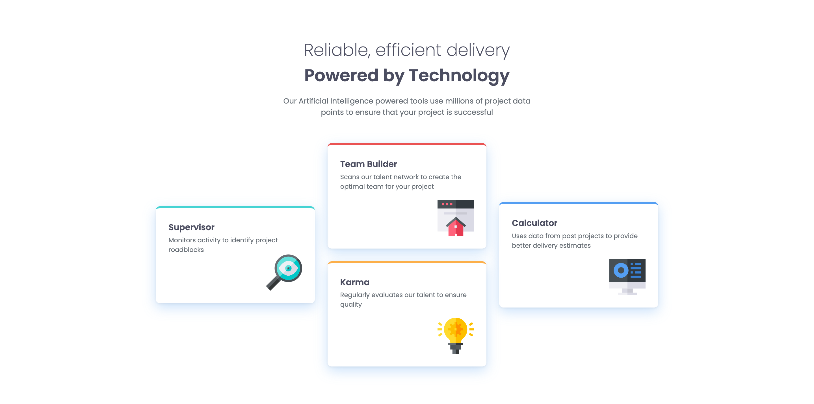

# Frontend Mentor - Four card feature section solution

This is a solution to the [Four card feature section challenge on Frontend Mentor](https://www.frontendmentor.io/challenges/four-card-feature-section-weK1eFYK). Frontend Mentor challenges help you improve your coding skills by building realistic projects. 

## Table of contents

- [Overview](#overview)
  - [The challenge](#the-challenge)
  - [Screenshot](#screenshot)
  - [Links](#links)
- [My process](#my-process)
  - [Built with](#built-with)
  - [What I learned](#what-i-learned)
  - [Continued development](#continued-development)
  - [Useful resources](#useful-resources)

## Overview

### The challenge

Users should be able to:

- View the optimal layout for the site depending on their device's screen size

### Screenshot



### Links

- Solution URL: [https://github.com/dpencsi/frontendmentor-four-card-feature-section](https://github.com/dpencsi/frontendmentor-four-card-feature-sectionm)
- Live Site URL: [https://dpencsi.github.io/frontendmentor-four-card-feature-section/](https://dpencsi.github.io/frontendmentor-four-card-feature-section/)

## My process

### Built with

- Semantic HTML5 markup
- CSS custom properties
- Flexbox
- CSS Grid
- Mobile-first workflow

### What I learned

So this four card layout part was interesting and was able to solve it with `grid`.

So first I made the HTML structure
```html
<div class="feature-cards">
  <div class="card"></div>
  <div class="card"></div>
  <div class="card"></div>
  <div class="card"></div>
</div>
```

I used searched for some help about grid, a grid cheatsheet, and I found a website and a nice grid property `grid-auto-flow: column;`. I kinda aleady had an idea that it would be nice if I can center vertically the light-blue and the blue card in that grid layout somehow and `grid-auto-flow` helped. Plus I needed one extra property for those two cards `align-self` I knew I only need it for the desktop size the tricky part but the `align-self` was okay to be on the cards normally it doesn't effect the mobile first logic. Finally the `grid-row-start: span 2;` helped me for the card to take two place (an entire column).

```css
.feature-cards {
    margin-block-start: var(--size-5xl);
    display: grid;
    grid-template-columns: 1fr;
    place-items: center;
    gap: var(--size-2xl);
}

.card-lblue {
    border-color: var(--cyan);
    grid-row-start: span 2;
    align-self: center;
}

.card-blue {
    border-color: var(--blue);
    grid-row-start: span 2;
    align-self: center;
}

/* 700px */
@media (min-width: 43.75rem) {
    .feature-cards {
        grid-auto-flow: column;
        grid-template-columns: repeat(3, 1fr);
        grid-template-rows: 1fr 1fr;
        place-items: center;
    }
}
```

### Continued development

I would like to use `clamp` for the font size more offen. I only used here for the title.

### Useful resources

- [GRID cheatsheet](https://grid.malven.co/) - This helped me for the light-blue and blue cards on the side of the grid layout. Its a very nice website with simple little illustrations what a grid property do.
- [Pixel to REM Converter](https://nekocalc.com/px-to-rem-converter) - Again I used pixel to rem converter because I like to test things with pixel then change them to rem.
